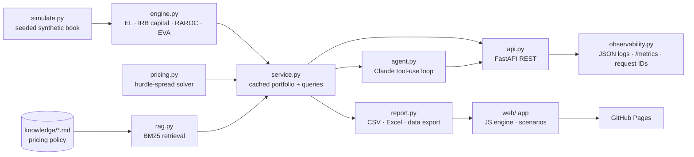

# Commercial Lending Portfolio Pricing & RAROC

[](https://github.com/ketibak-ai/commercial-lending-raroc/actions/workflows/ci.yml)
[](https://ketibak-ai.github.io/commercial-lending-raroc/)

An end-to-end commercial banking pricing system:

- **A simulated portfolio:** 1,000 term loans, 2,000 revolvers, 20 interest rate derivatives (IRDs), 2,000 deposit accounts and 2,000 payments / treasury management services across 500 client relationships.
- **A RAROC engine** at the account, relationship and product level.
- **A deal-pricing solver.**
- **A REST API.**
- **A Claude-powered pricing copilot** that grounds its answers in the engine and a policy knowledge base (RAG).

Ten **key relationships** are the focus. For these clients, deposits, payments and hedging decide whether the credit earns its cost of capital.

**Live app:** https://ketibak-ai.github.io/commercial-lending-raroc/

The app has seven tabs:
- **Overview:** portfolio and product RAROC plus the 10 key relationships.
- **Relationships:** all 500 clients, searchable and sortable, each with a drill-down to its accounts.
- **Accounts:** all 7,020 accounts, filterable, with CSV download.
- **Scenarios & pricing:**
  - Rate, credit, pricing and deposit levers, applied to the whole book, the key clients, or one client.
  - Presets (recession, rate moves, Blue Mesa remediation) and a new-deal pricer.
  - Scenarios can be saved or shared as a link.

- **Curves:** the SOFR curve (Term SOFR, SOFR swaps), liquidity premium, FTP, Treasuries and Prime, with the scenario-shocked curve overlaid.
- **Risk & capital models:** choose the capital basis, Basel approach, EL model, PIT factors and ECAP method. Every view recalculates.
- **Plans:** Community (free), Professional and Enterprise tiers, with a license-key unlock and a free Pro demo.

The RAROC engine runs in the browser. It is a JavaScript port tested against the Python engine on every account, under seven model configurations.

> All data is synthetic, generated with a fixed seed. It represents no real bank or client.
>
> **Independent development.** This project was built independently from public sources: Basel Committee
> standards, published credit-risk methodology and textbook RAROC practice. All parameters are
> illustrative. It contains no proprietary, confidential or client information of any current or former
> employer.

---

## Headline results

| Product | Accounts | Exposure | Revenue | Economic capital | RAROC |
|---|---:|---:|---:|---:|---:|
| Term Loan | 1,000 | $4.62B | $96.7M | $248.6M | **22.0%** |
| Revolver | 2,000 | $5.84B committed | $55.4M | $235.0M | **8.7%** ⚠ below hurdle |
| Interest Rate Derivative | 20 | $1.38B notional | $2.0M | $3.7M | **31.3%** |
| Deposit | 2,000 | $4.02B | $76.3M | $27.6M | **196.8%** |
| Payments | 2,000 | $35.7M fees | $33.9M | $5.1M | **213.0%** |
| **Total** | **7,020** | | **$264.3M** | **$520.1M** | **27.2%** |

Hurdle rate is 12%. Revolvers don't earn their capital on their own, and deposits and treasury management are what make the relationship profitable.

### The 10 key relationships

| Relationship | Lending-only RAROC | Relationship RAROC | Uplift from deposits + payments |
|---|---:|---:|---:|
| Summit Ridge Software | 21.4% | 84.6% | +63.2 pts |
| Harborview Health Partners | 16.2% | 41.0% | +24.8 pts |
| Prairie Harvest Foods | 20.1% | 39.5% | +19.4 pts |
| Northwind Manufacturing Group | 21.4% | 39.1% | +17.7 pts |
| Greenfield Agri Cooperative | 17.7% | 35.5% | +17.8 pts |
| Cascade Logistics Holdings | 15.5% | 34.1% | +18.6 pts |
| Lakeshore Retail Brands | 13.6% | 33.2% | +19.6 pts |
| Aurora Aerospace Components | 16.0% | 29.4% | +13.4 pts |
| Keystone Commercial Properties | 18.6% | 20.5% | +1.9 pts |
| Blue Mesa Energy Services ⚠ | 10.4% | 12.1% | +1.7 pts, **watch list** |

**Blue Mesa Energy:** a rating-7 energy credit that takes up capital but has few operating deposits. Its credit alone is below the hurdle, and the relationship only just clears it. A new $40MM revolver needs a **521 bps** spread; the relationship earns it only 45 bps of concession.

**Summit Ridge Software:** a deposit-rich tech client. A $25MM term loan can be priced at the **78 bps cost floor**, well below its 119 bps stand-alone floor. The deposits pay for the discount.

---

## Rate curves

Pricing runs off SOFR:
- **Floating loans and revolvers:** coupon = 1M Term SOFR + spread.
- **Fixed loans:** coupon = the SOFR swap rate at the original tenor + spread.
- **Funds transfer pricing:** matched-maturity SOFR + a term liquidity premium (5 bps a year, capped at 25 bps).
- **Deposits:** credited at that FTP curve, adjusted for run-off.
- **Capital credit:** the 1Y FTP rate.
- **Reference only:** Treasury yields and Prime.

Scenarios can shift the SOFR curve in parallel or twist it around the 2Y point (steepener or flattener), and include Bear steepener and Bull flattener presets. The levels are illustrative, not market data. The curve is calibrated so the SOFR-based FTP reproduces the original matched-maturity FTP exactly. Curves are in `config.SOFR_CURVE`, `LIQUIDITY_PREMIUM_CURVE` and `UST_CURVE`, and served at `GET /curves`.

## Risk and capital models

| Model | Options | Where |
|---|---|---|
| **Expected loss** | EL = PD × LGD × EAD on **TTC** or **point-in-time** PD; lifetime (CECL-style) EL on PIT PD | `engine._credit` |
| **PIT factors** | Single-factor Z-shift, PD<sub>PIT</sub> = N(N⁻¹(PD<sub>TTC</sub>) − √ρ·Z); credit-cycle Z by industry plus a portfolio shift; Z = 0 reproduces TTC | `config.CREDIT_CYCLE_Z`, `engine.pit_pd` |
| **Economic capital** | **Analytic** (ASRF at 99.9%, ×1.06) or a calibrated **factor table**: rating × maturity bucket at 99.95%, 15% diversification benefit, industry concentration multipliers | `engine.ecap_factor_table` |
| **Regulatory capital** | Basel III **Standardized** (rating-mapped risk weights, 40% CCF), **Foundation IRB** (supervisory LGD, M = 2.5), **Advanced IRB** (downturn LGD, LGD floors, own CCF), optional **72.5% output floor**, 5 bp PD floor, SMA op risk; capital = RWA × CET1 target (10.5%) | `engine._credit`, `config` |
| **Capital basis for RAROC** | Economic, regulatory, or the higher of the two (binding constraint) | `config.ModelSettings` |

Choose the settings in the app, through the API (`/portfolio/summary?capital_basis=regulatory&basel_approach=SA`), or in Python:

```python
from raroc import service
from raroc.config import ModelSettings
service.portfolio_summary(ModelSettings(capital_basis="max", basel_approach="AIRB", output_floor=True, el_pd_basis="PIT"))
```

| Approach (same book) | Capital | RWA | Portfolio RAROC |
|---|---:|---:|---:|
| Economic, analytic | $520M | n/a | 27.2% |
| Economic, factor table | $560M | n/a | 25.5% |
| Regulatory, Standardized | $814M | $7.76B | 18.4% |
| Regulatory, Foundation IRB | $444M | $4.23B | 31.4% |
| Regulatory, Advanced IRB | $702M | $6.68B | 20.9% |
| Regulatory, A-IRB + output floor | $751M | $7.16B | 19.7% |

## Plans (open core)

This repository is the open, MIT-licensed core: the engine, the models, the API and the demo app.
The app is packaged as a product with three tiers:
- **Community:** free.
- **Professional:** model settings, custom scenarios, save and share, CSV export.
- **Enterprise:** own data, API, AI copilot, SSO, VPC.

Professional features unlock with a signed license key or a free in-browser demo. License issuing
and the commercial plan live in a separate private repository. In the static demo the gates are
client-side. The SaaS stage moves paid features behind a server-side entitlement check.

## Architecture



## Skills this project demonstrates

| Area | Where |
|---|---|
| Python, data engineering | `simulate.py`, `engine.py`: vectorised pandas/numpy over 7,020 accounts |
| Front end | `web/`: dependency-free JS app with a live scenario engine, drill-downs, sortable tables and SVG charts |
| Banking domain modelling | FTP, Basel III SA / F-IRB / A-IRB with output floor, economic capital factor tables, TTC vs PIT PD, lifetime EL, SA-CCR, CCF, LCR run-off, ECR, relationship pricing |
| API design and integration | `api.py`: FastAPI with typed validation, error mapping, optional API-key auth |
| LLM pipeline and agents | `agent.py`: Claude tool use, adaptive thinking, prompt caching, refusal fallbacks |
| RAG | `rag.py` + `knowledge/`: section-level chunking, BM25, cited answers |
| Evaluation | `evals/`: offline retrieval eval in CI, deterministic end-to-end agent eval |
| Testing | `tests/`: engine maths, Basel and model behaviour, API contract, agent loop tested with a fake Claude client, browser-engine parity on all 7,020 accounts under 7 model settings |
| Cloud deployment, CI/CD | `Dockerfile` (non-root, healthcheck), GitHub Actions: lint, test, eval, image build + smoke test, Pages deploy |
| Observability | Structured JSON logs with request IDs, Prometheus `/metrics`, per-tool latency, token usage |
| Security and responsible AI | Secrets from env only, constant-time API-key check, input bounds, policy text treated as data, no PII |

---

## Methodology

```
Revenue         = NII (spread over FTP − liquidity premium) + fees
Expected loss   = PD(rating) × LGD(collateral) × EAD
Econ. capital   = IRB K(PD, LGD, M) × EAD × 1.06  +  15% × revenue (op risk)
Net income      = (Revenue − Opex − EL + 3.85% × Capital) × (1 − 24%)
RAROC           = Net income / Economic capital          hurdle = 12%
EVA             = Net income − 12% × Economic capital
```

| Product | Revenue | Exposure / EAD | Capital |
|---|---|---|---|
| Term loan | spread + upfront fee amortised | balance | IRB, M = remaining life (1–5y) |
| Revolver | drawn spread + unused fee − contingent liquidity | drawn + 75% × undrawn | IRB |
| IRD | sales credit bps × notional | 1.4 × (MTM⁺ + add-on × notional) | IRB × 1.25 (CVA) |
| Deposit | balance × (FTP credit − rate paid), with FTP credit adjusted for run-off | n/a | 0.40% op/ALM |
| Payments | fees − ECR offset; 55% cost/income | n/a | op risk only |

**Deal pricing.** `pricing.py` uses bisection to find:
- the **stand-alone floor**: the spread at which the deal alone earns 12%.
- the **relationship floor**: the spread at which the whole relationship, including the new deal, earns 12%.

The recommended spread is the higher of the relationship floor and the **cost floor**, which is EL rate + 25 bps liquidity + 45 bps opex.

Policies the copilot cites are in [`knowledge/`](knowledge).

---

## Quickstart

```bash
pip install -e ".[dev]"
raroc simulate                      # writes data/, reports/ (CSV + Excel), docs/index.html
raroc price --product Revolver --amount 40e6 --tenor-yrs 3 --rating 7 \
            --collateral Unsecured --utilization 0.3 --relationship-id R007
pytest -q                           # 62 tests (incl. JS/Python parity across 7 model settings)
python evals/retrieval_eval.py      # offline RAG eval
```

### API

```bash
uvicorn raroc.api:app --reload      # docs at http://localhost:8000/docs
curl localhost:8000/relationships/key
curl -X POST localhost:8000/price -H 'content-type: application/json' \
     -d '{"product":"Term Loan","amount":25000000,"rating":4,"relationship_id":"R004"}'
```

| Method | Path | Purpose |
|---|---|---|
| GET | `/health` · `/metrics` | liveness, Prometheus metrics |
| GET | `/portfolio/summary` | RAROC by product; model settings as query parameters |
| GET | `/curves` | SOFR, liquidity premium, FTP and Treasury curves |
| GET | `/models/ecap-factors` · `/models/pit-factors` | ECAP factor table, PIT PDs by industry |
| GET | `/relationships/key` · `/relationships/{id}` | key-relationship scorecard, drill-down |
| POST | `/price` | deal pricing |
| POST | `/policy/search` | RAG over pricing policy |
| POST | `/ask` | AI pricing copilot |

### AI pricing copilot

```bash
export ANTHROPIC_API_KEY=...        # or: cp .env.example .env
raroc ask "Price a 40MM 3y unsecured revolver for Blue Mesa (R007), rating 7, 30% drawn. Who must approve the concession?"
```

The agent has five tools: `get_portfolio_summary`, `list_key_relationships`, `get_relationship`, `price_deal` and `search_policy`.
- **Numbers:** every number comes from a tool result.
- **Policy:** policy claims are cited as `[Policy: document § section]`.
- **Tracing:** each call's tools, tokens and latency are logged and returned in the response.
- **Model:** set with `RAROC_MODEL`, default `claude-opus-5`.

### Docker

```bash
docker build -t commercial-lending-raroc .
docker run -p 8000:8000 -e ANTHROPIC_API_KEY -e APP_API_KEY=change-me commercial-lending-raroc
```

---

## Evaluation

| Eval | Runs | What it checks | Latest |
|---|---|---|---|
| `evals/retrieval_eval.py` | every CI run, offline | 18 policy questions → correct section in top-3 | hit@3 **100%**, hit@1 **94%** |
| `evals/agent_eval.py` | manual workflow (`agent-eval.yml`, needs `ANTHROPIC_API_KEY` secret) | 8 end-to-end questions graded deterministically: required tools called, ground-truth numbers from the engine appear in the answer, policy facts present, out-of-scope handled | run on demand |

## Project structure

```
src/raroc/      config · simulate · engine · pricing · rag · agent · service · api · report · cli · observability
knowledge/      pricing, RAROC, FTP, treasury and derivatives policies (RAG corpus)
tests/          engine, pricing, API and agent-loop tests
evals/          retrieval + agent evals
data/           simulated accounts (CSV)
reports/        account/relationship/product RAROC (CSV) + portfolio_raroc.xlsx
src/raroc/web/  browser app: engine.js (RAROC + pricing), app.js (UI), index.html
docs/           built site served by GitHub Pages (app + data.js)
```

## License

MIT
